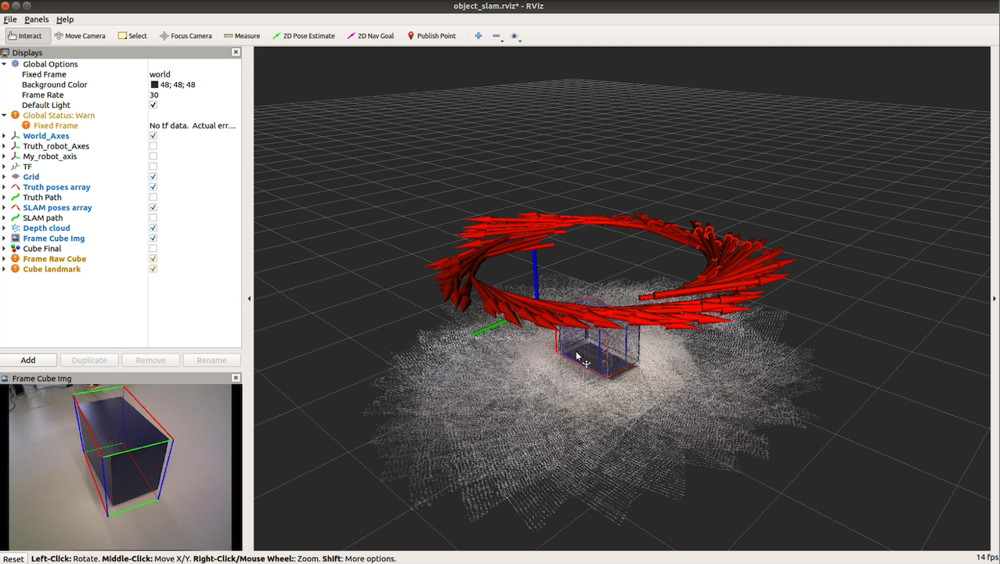
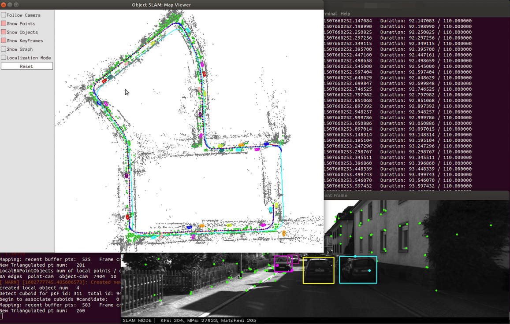
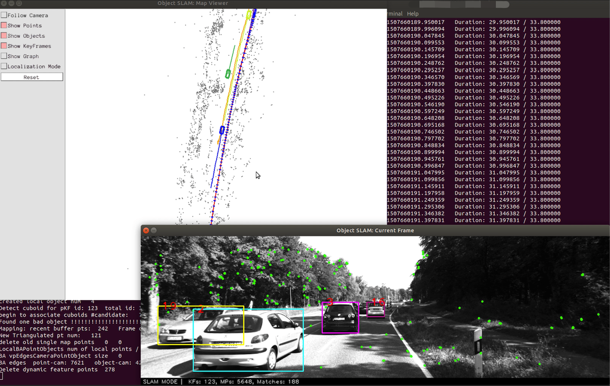

# Cube SLAM #
(Forked from [**Shichao Yang**](https://github.com/shichaoy): [**cube_slam**](https://github.com/shichaoy/cube_slam), a modification of Cube SLAM for **Ubuntu 18.04 + ROS Melodic + OpenCV 3.1** and our own datasets)








- This code contains two mode:
1)  object SLAM integrated with ORB SLAM. See ```orb_object_slam```  Online SLAM with ros bag input. It reads the offline detected 3D object.
2) Basic implementation for Cube only SLAM. See ```object_slam``` Given RGB and 2D object detection, the algorithm detects 3D cuboids from each frame then formulate an object SLAM to optimize both camera pose and cuboid poses. This is the main package. ```detect_3d_cuboid``` is the C++ version of single image cuboid detection, corresponding to a [matlab version](https://github.com/shichaoy/matlab_cuboid_detect).

**Authors:** [Shichao Yang](https://shichaoy.github.io/)

**Related Paper:**

* **CubeSLAM: Monocular 3D Object SLAM**, IEEE Transactions on Robotics 2019, S. Yang, S. Scherer  [**PDF**](https://arxiv.org/abs/1806.00557)

If you use the code in your research work, please cite the above paper. Feel free to contact the authors if you have any further questions.


## Installation

### Prerequisites
This code contains several ros packages. We test it in **ROS indigo/kinetic/melodic, Ubuntu 14.04/16.04/18.04, Opencv 2/3**. Create or use existing a ros workspace.
```bash
mkdir -p ~/cubeslam_ws/src
cd ~/cubeslam_ws/src
catkin_init_workspace
git clone git@github.com:zha0ming1e/cube_slam_modified.git
cd cube_slam
```

### Compiling g2o
```bash
sh install_dependenices.sh
```


### Compiling 
```bash
cd ~/cubeslam_ws
catkin_make -j4
```


### Downloading the vocabulary 
You can dowload the `ORBvoc.txt.tar.gz` from [ORB-SLAM2 Vocabulary](https://github.com/raulmur/ORB_SLAM2/tree/master/Vocabulary) to `orb_object_slam/Vocabulary/`, and run: 
```bash
tar xzvf ORBvoc.txt.tar.gz 
``` 
Then the vocabulary file `ORBvoc.txt` is in the directory. 


### Running 
```bash
source devel/setup.bash
roslaunch object_slam object_slam_example.launch
```
You will see results in Rviz. Default rviz file is for ros indigo. A kinetic version is also provided.

To run orb-object SLAM in folder ```orb_object_slam```, download [data](https://drive.google.com/open?id=1FrBdmYxrrM6XeBe_vIXCuBTfZeCMgApL). Set correct data and vocabulary path in ```mono.launch``` , then run following in two terminal:
``` bash
roslaunch orb_object_slam mono.launch
rosbag play PATH_TO_DATA/seq_07/left_full_gray.bag --clock -r 0.5
```

To run dynamic orb-object SLAM mentioned in the paper, download [data](https://drive.google.com/drive/folders/1T2PmK3Xt5Bq9Z7UhV8FythvramqhOo0a?usp=sharing). Similar to above, set correct data and vocabulary path in ```mono_dynamic.launch```, then run the launch file with bag file in two terminal: 
```bash
roslaunch orb_object_slam mono_dynamic.launch
rosbag play PATH_TO_DATA/0018/mono.bag --clock -r 0.5
```


If compiling problems met, please refer to [ORB_SLAM](https://github.com/raulmur/ORB_SLAM) or [ORB_SLAM2](https://github.com/raulmur/ORB_SLAM2).


### Notes

1. For the online orb object SLAM, we simply read the offline detected 3D object txt in each image. Many other deep learning based 3D detection can also be used similarly especially in KITTI data.

2. In the launch file (```object_slam_example.launch```), if ```online_detect_mode=false```, it requires the matlab saved cuboid images, cuboid pose txts and camera pose txts.  if ```true```, it reads the 2D object bounding box txt then online detects 3D cuboids poses using C++.

3. ```object_slam/data/``` contains all the preprocessing data: 

    ```depth_imgs/``` is just for visualization;

    ```pred_3d_obj_overview/``` is the offline matlab cuboid detection images;

    ```detect_cuboids_saved.txt``` is the offline cuboid poses in local ground frame, in the format "3D position, 1D yaw, 3D scale, score".

    ```pop_cam_poses_saved.txt``` is the camera poses to generate offline cuboids (camera x/y/yaw = 0, truth camera roll/pitch/height);

    ```truth_cam_poses.txt``` is mainly used for visulization and comparison;

    ```filter_2d_obj_txts/``` is the 2D object bounding box txt. We use Yolo to detect 2D objects. Other similar methods can also be used;

    ```preprocessing/2D_object_detect``` is our prediction code to save images and txts. Sometimes there might be overlapping box of the same object instance. We need to filter and clean some detections. See the [```filter_match_2d_boxes.m```](https://github.com/shichaoy/matlab_cuboid_detect/blob/master/filter_match_2d_boxes.m) in our matlab detection package.
